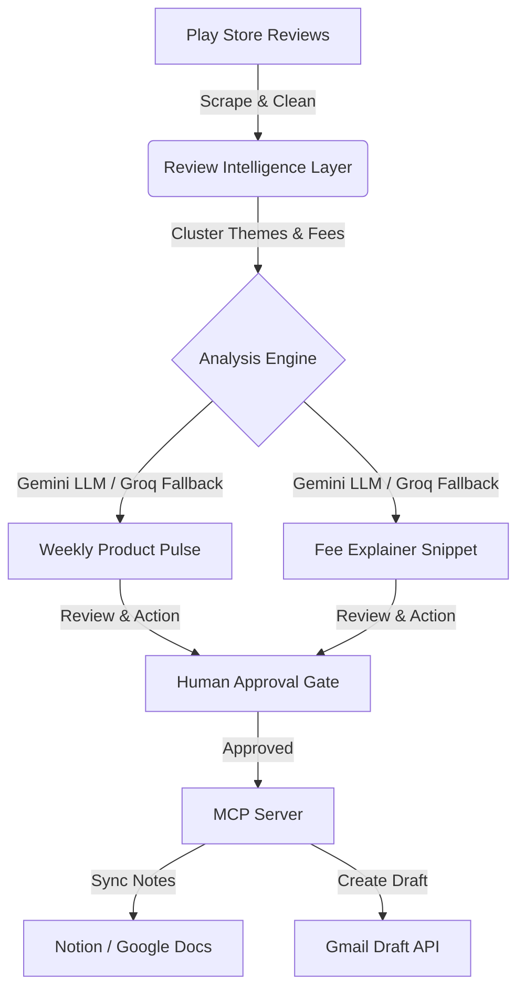

# Product Requirement Document (PRD)
## Product Name: Product Insight Copilot (InsightFlow)
**Author:** AI Product Architect  
**Status:** Draft for Review  
**Date:** June 19, 2026  

---

## 1. Executive Summary & Core Hypothesis
### 1.1 Product Overview
The **Product Insight Copilot** is an AI-powered agentic workflow system designed to bridge the operational gap between Product Management (PM) and Customer Support (CS). In high-volume consumer applications (such as fintech, ride-hailing, e-commerce, and SaaS), changes to pricing, fees, or policy updates frequently trigger waves of user anxiety, confusion, and negative app store reviews. 

This product automates the extraction of raw customer feedback (via Google Play Store scraping), isolates semantic themes, detects recurring pain points regarding specific fees/charges, and drafts two critical deliverables:
1. **Weekly Product Pulse:** An internal diagnostic briefing for the product and engineering teams.
2. **Fee Explainer:** A facts-only, structured customer-facing snippet for customer support agents.

Using **Model Context Protocol (MCP)**, these assets are synced to internal document repositories (e.g., Notion, Google Docs) and queued as draft email communications—all behind a strict, human-in-the-loop approval gate.



### 1.2 The Core Hypothesis: Why This Product Works
* **Actionability Over Analytics:** Existing feedback aggregators show charts and sentiment curves (e.g., "75% negative sentiment on pricing"), which are passive. Product Insight Copilot generates *active outputs* (weekly pulses, support snippets, and drafts) directly from the raw data.
* **Proactive Deflection:** By instantly generating clear, approved explanations for specific billing confusion, support teams can deploy templates (macros/canned replies) within minutes of a theme trending, deflecting volume before it hits Zendesk or scales out of control.
* **Cross-Functional Alignment:** The tool aligns product improvement logic (internal updates) with support messaging (customer updates), ensuring that the engineering team’s backlog is synchronized with customer-facing communications.

---

## 2. Market Analysis & Alternatives
To validate the product's positioning, we analyze how teams currently handle feedback and review analysis:

| Alternative / Competitor | How It Works | Gaps / Weaknesses | Insight Copilot Advantage |
| :--- | :--- | :--- | :--- |
| **Traditional ASO Tools** *(e.g., AppFollow, AppTweak, Data.ai)* | Scrapes reviews, measures sentiment, tracks rating history over time. | Focuses on marketing and SEO metrics. Does not cluster specific root causes or draft detailed textual outputs. | Directly drafts internal product briefs and customer explanations. |
| **Feedback Hubs** *(e.g., Productboard, UserVoice, Dovetail)* | Integrates with Zendesk; relies on manual tagging to compile user requests. | Heavy operational overhead. Requires PMs to manually read, tag, and organize feedback. Does not act as an automated compiler. | Fully automated extraction, cleaning, clustering, and snippet creation. |
| **In-House Manual Workflows** *(e.g., Python scripts + PM Manual Review)* | PMs or support leads export CSVs weekly, read them, write slide decks, and update internal docs. | Extremely slow feedback loop (7-14 days). Inconsistent formatting. Prone to human bottleneck. | Execution takes <5 minutes. Standardized templates ensure consistency. |

---

## 3. User Personas & Pain Points

### 3.1 Persona A: Sarah, Lead Product Manager (Fintech App)
* **Goal:** Understand customer sentiment regarding recent product updates and pricing revisions to prioritize the development backlog.
* **Pain Points:** 
  * Receives thousands of Google Play Store reviews daily. Most are noise ("Great app!", "Works well", or unhelpful bug comments like "won't load").
  * Spends 4-6 hours every Monday reading reviews manually to extract actionable insights.
  * Misses emerging issues until they cause a severe drop in the store rating.
* **Anecdote:** 
  > *"When we updated our processing fees, it was buried in the terms of service. Customers immediately noticed and started leaving 1-star reviews about 'hidden charges.' I didn't see the trend until my weekly report came out two weeks later. By then, our Play Store score had dropped from 4.7 to 4.3, and it took us months to recover. If I had an automated weekly pulse flag, we would have adjusted the app UI onboarding text in days."*

### 3.2 Persona B: David, Head of Customer Support (Fintech App)
* **Goal:** Provide fast, accurate, and consistent explanations to customers asking about unexpected fees.
* **Pain Points:**
  * Support agents give inconsistent answers to users complaining about the same charge because they lack approved, plain-language templates.
  * Creating a canned response (macro) requires coordinate meetings between Product, Legal, and Support, taking over a week.
* **Anecdote:** 
  > *"When exit load fees were charged on investments, customers went crazy. My support agents had no pre-approved snippet. Half the team told users it was a government tax, and the other half said it was a bank charge. It was a customer service disaster and a legal risk. We need a system that detects what users are confused about, instantly drafts the neutral explanation, and drops it into our documents for quick approval."*

---

## 4. Product Goals & Success Metrics
We will measure the product’s success across three core domains: efficiency, accuracy, and operational impact.

```
                  PRODUCT SUCCESS METRICS
┌───────────────────────┬────────────────────────┬──────────────────────┐
│      EFFICIENCY       │        ACCURACY        │  OPERATIONAL IMPACT  │
├───────────────────────┼────────────────────────┼──────────────────────┤
│  90% reduction in     │  95% thematic accuracy │  20% reduction in CS │
│  review-to-snippet    │  vs. manual tag lists  │  tickets on billing  │
│  turnaround time      │  compiled by PMs       │  and fee confusion   │
└───────────────────────┴────────────────────────┴──────────────────────┘
```

### 4.1 Primary KPIs (Key Performance Indicators)
* **Time-to-Asset Generation:** Reduce the time it takes to detect fee confusion and generate support materials from 7 days (manual process) to **under 15 minutes** (automated flow + human review).
* **Support Ticket Deflection:** Achieve a **15% to 25% reduction** in support tickets related to recurring fee confusion within 30 days of deploying the generated explainer snippets to customer-facing channels.
* **Workflow Adoption Rate:** At least **80%** of generated Weekly pulses and Fee Explainers are approved and synced via MCP by the review team without requiring heavy manual rewriting.

### 4.2 Secondary Quality Metrics
* **Clustering Precision:** Under 5% false-positive rate in identifying pricing issues (ensuring standard operational bugs are not falsely flagged as "fee confusion").
* **LLM Success Rate:** Under 2% API error or timeout rates, with fallback routing successfully mitigating primary model downtime.

---

## 5. Detailed Feature Requirements

### 5.1 Step 1: Review Intelligence Layer (Data Processing)
The system must ingest raw public reviews, sanitize the data, and extract structured semantic clusters.
* **Ingestion:** Scrape recent reviews for the designated application from the Google Play Store (covering the last 8 to 12 weeks).
* **Sanitization:** 
  * Remove duplicate reviews, empty comments, and emoji-only reviews.
  * Exclude reviews older than the 12-week threshold.
  * Output the clean review set to a structured CSV.
* **Clustering & Theme Extraction:**
  * Categorize the reviews into a maximum of **5 major themes** (e.g., Performance, UI/UX, Fee/Billing Confusion, Login Issues, Account Verification).
  * Identify the **top 3 themes** based on frequency and severity.
  * Extract **3 real user quotes** that representative of each theme.
* **Fee/Charge Isolation:**
  * Detect exactly **1 recurring misunderstanding or complaint** related to a specific fee, commission, or charge (e.g., "exit load", "convenience fee", "processing fee", "maintenance fee").

### 5.2 Step 2: Weekly Product Pulse Generator (Internal Output)
Using the structured data from Step 1, the system compiles a professional internal briefing for the product and engineering teams.
* **Format:** Markdown document.
* **Length:** Strict limit of **≤250 words**.
* **Structure:**
  1. **Summary:** Concisely outline the top 3 themes identified in user reviews.
  2. **Supporting Quotes:** Include the extracted real user quotes to ground the summary in raw user voice.
  3. **Key Observation:** Highlight what is trending downwards, what is broken, or where the customer sentiment friction is highest.
  4. **Actionable Ideas:** Propose **3 concrete action ideas** for the product development team to solve the underlying issues.

### 5.3 Step 3: Fee Explainer Generator (Customer-Facing Output)
Based on the isolated fee issue detected in Step 1, generate a clear, authoritative explanation template for support agents.
* **Tone:** Facts-only, objective, neutral, and helpful. Avoid defensive language or PR spin.
* **Length:** Strict limit of **≤6 bullet points**.
* **Integrity Requirements:**
  * Must reference the specific fee identified in the reviews (no generic templates).
  * Include exactly **2 official resource links** (e.g., the company's Help Center, official terms and conditions, or pricing pages).
  * Conclude with a metadata string: `"Last checked: YYYY-MM-DD"`.

### 5.4 Step 4: Approval-Gated MCP Orchestration
Once the Weekly Pulse and Fee Explainer are compiled, they cannot be published or distributed automatically. A human reviewer must approve the output.

```
[Raw Generation Output]
          │
          ▼
┌──────────────────────────────────────────────┐
│         Human Approval Dashboard/CLI         │
│  [ Approve Outputs ]    [ Reject/Modify ]   │
└──────────────────────┬───────────────────────┘
                       │ (Upon Approval)
                       ▼
         ┌─────────────┴─────────────┐
         │  Model Context Protocol   │
         └─────────────┬─────────────┘
          ┌────────────┴────────────┐
          ▼                         ▼
┌──────────────────┐      ┌──────────────────┐
│  Notes Sync Tool │      │ Email Draft Tool │
│  Appends entry   │      │ Creates draft    │
│  to Notion/Docs  │      │ in Gmail         │
└──────────────────┘      └──────────────────┘
```

* **Approval Interface:** The workflow pauses and displays the compiled output to the user via a terminal command-line prompt, button, or simple UI, asking: `Do you approve these outputs for internal notes and email drafts? [Y/N]`.
* **MCP Action 1 (Append to Document):** On approval, format the structured payload below and append it as a new entry to a shared wiki, document, or local knowledge repository (e.g., Notion, Google Docs, or Markdown database):
  ```json
  {
    "date": "YYYY-MM-DD",
    "top_themes": ["Theme A", "Theme B", "Theme C"],
    "weekly_pulse": "...",
    "identified_fee_issue": "...",
    "explanation_bullets": ["Bullet 1", "Bullet 2", "..."],
    "source_links": ["Link 1", "Link 2"]
  }
  ```
* **MCP Action 2 (Create Email Draft):** Connect to Gmail or an SMTP draft server to compile an email draft:
  * **Subject Line:** `Weekly Product Pulse + Customer Clarification — [Fee Name/Issue]`
  * **Body:** Pre-populate with the *Weekly Product Pulse* (for internal awareness) followed by the *Fee Explainer* (designated as a reusable support snippet).
  * **Constraint:** The email draft must be created in the user's "Drafts" folder and **must not be sent automatically**.

---

## 6. Technical Stack & AI Orchestration
To maximize cost-efficiency, processing speed, and reliability, the system employs a dual-model orchestration strategy.

```
                     Review CSV Ingestion
                              │
                              ▼
                ┌───────────────────────────┐
                │    Primary LLM API        │
                │    (Google Gemini)        │
                └─────────────┬─────────────┘
                              │
                  ┌───────────┴───────────┐
      Success?  Yes │                     │ No (Failure/Timeout)
                    ▼                     ▼
             [Process Output]    ┌─────────────────┐
                                 │   Fallback LLM  │
                                 │      (Groq)     │
                                 └────────┬────────┘
                                          │
                                          ▼
                                   [Process Output]
```

### 6.1 LLM Strategy
1. **Primary Model: Google Gemini API (Gemini 1.5 Pro / Flash)**
   * *Why:* Gemini is selected as the primary engine due to its market-leading context window, native support for processing large tables of raw data (CSV ingestion), and low-cost reasoning. It excels at parsing unstructured text and clustering without truncating inputs.
2. **Fallback Model: Groq API (e.g., Llama-3-70B)**
   * *Why:* In the event of Gemini API rate-limiting, network timeouts, or service degradation, the orchestration system must catch the error and route the payload to Groq. Groq’s ultra-low latency guarantees that the batch execution completes without hanging.

### 6.2 Streaming & Real-time Integration (Phase 2 Upgrade)
* **Technology:** **Gemini Live API** (WebSockets connection).
* *Why:* In Phase 2, instead of processing batch CSV exports weekly, the system will use a WebSocket connection to stream incoming reviews from the Play Store API. 
* *Behavior:* As raw strings stream in, a lightweight semantic filter monitors for billing anomalies (e.g., "Why did I get charged...", "exit load scam"). If a threshold is crossed (e.g., more than 5 complaints in 1 hour), the Gemini Live API alerts the Product/Support team channel and generates an instant diagnostic explainer.

---

## 7. Edge Cases & Mitigation Strategies

| Edge Case Scenario | Impact | System Mitigation |
| :--- | :--- | :--- |
| **No Billing/Fee Issues Found** | The LLM might hallucinate a non-existent fee complaint or fail to write the explainer. | *Mitigation:* The system prompt directs the LLM to search for pricing keywords first. If none are found, it skips the explainer and outputs: `"No recurring fee confusion detected this week."` |
| **Multi-Language Reviews** | Reviews written in Spanish, Hindi, or German will fail to cluster correctly under English themes. | *Mitigation:* The Review Intelligence Layer executes an initial translation/normalization sweep. Reviews are translated to English before being parsed by the clustering engine. |
| **Outdated or Hallucinated Links** | The LLM may generate broken URLs for the Fee Explainer's required source links. | *Mitigation:* Provide the LLM with a strict, pre-approved list of 10-15 official help URLs (Pricing policy, exit load FAQ, account guidelines). The LLM is constrained to choose *only* from this verified array. |
| **API Failures During MCP Runs** | The Notion database or Gmail API is down, causing the approved data to be lost. | *Mitigation:* The system implements local state storage. If the MCP tool call fails after human approval, the data is saved in a local backup directory (`/scratch/pending_mcp_sync.json`) and retried when connection is re-established. |

---

## 8. Implementation Phases

```
                  IMPLEMENTATION TIMELINE
┌─────────────────────────┬─────────────────────────┬─────────────────────────┐
│     PHASE 1 (MVP)       │   PHASE 2 (STREAMING)   │   PHASE 3 (ADVANCED)    │
│  Batch CSV Processing   │   Gemini Live API &     │   Auto-Macro Sync &     │
│  & Dual-Model Fallback  │   Real-time Alerts      │   Zendesk Integration   │
├─────────────────────────┼─────────────────────────┼─────────────────────────┤
│ Weeks 1 - 4             │ Weeks 5 - 8             │ Weeks 9 - 12            │
└─────────────────────────┴─────────────────────────┴─────────────────────────┘
```

### Phase 1: MVP - Batch Ingestion & Core Workflow (Current Target)
* **Goal:** Establish the Review Intelligence Layer and the core output formats.
* **Scope:**
  * Implement Python/JS script to clean Play Store review CSVs.
  * Integrate Gemini API with Groq fallback handler.
  * Build simple terminal-based approval mechanism.
  * Configure local MCP servers to write to markdown files and output email text.
* **Target Delivery:** 4 weeks.

### Phase 2: Streaming & Real-Time Alerts (Gemini Live API)
* **Goal:** Shift from batch processing to continuous monitoring.
* **Scope:**
  * Set up Play Store webhook listeners.
  * Implement streaming analysis utilizing the **Gemini Live API** over WebSockets.
  * Create a lightweight dashboard indicating running theme metrics.
  * Deploy production MCP servers connecting directly to Slack, Google Workspace, and Notion.
* **Target Delivery:** 4 weeks.

### Phase 3: Closed-Loop Support Automation & Self-Learning
* **Goal:** Fully automate the integration with Support ticketing systems.
* **Scope:**
  * Build native Zendesk/Intercom integrations to sync generated Fee Explainers directly into team macros.
  * Implement a feedback loop: analyze how support agents edit the LLM-generated snippets, and feed those edits back to the prompt base to improve tone matching.
* **Target Delivery:** 4 weeks.

---

## 9. Go-To-Market (GTM) & Rollout Plan

### 9.1 Targeting & Ideal Customer Profile (ICP)
* **Primary Target:** B2C Fintech, Neo-banks, and Micro-investment platforms. These apps have complex fees (exit loads, brokerage fees, deposit charges, convenience rates) and see frequent user reviews regarding pricing.
* **Secondary Target:** E-commerce delivery platforms and ride-hailing services facing pricing surge complaints.

### 9.2 Launch Milestones
* **Milestone 1: Closed Beta (Weeks 1-3 post-MVP)**
  * Deploy the tool internally to 3 partner Fintech product teams.
  * Run side-by-side accuracy tests comparing the automated *Weekly Product Pulse* against manually compiled product briefs.
* **Milestone 2: Open Source CLI Release (Week 4)**
  * Release a lightweight, open-source CLI version on GitHub.
  * Allow developers to run the Review Intelligence Layer locally with their own CSV files using their Gemini/Groq keys.
* **Milestone 3: Cloud SaaS Platform Launch (Phase 2/3)**
  * Package the workflow as a hosted cloud app with a graphical interface.
  * Integrate one-click setup for App Store and Play Store review tracking.

### 9.3 Pricing & Monetization (Future SaaS Model)
* **Developer Tier:** Free, local CLI usage (bring-your-own API keys).
* **Pro Tier ($79/month):** Automated daily ingestion of up to 3 apps, standard Notion/Docs/Gmail integrations, basic email alerts.
* **Enterprise Tier ($499+/month):** Custom MCP servers, Gemini Live API streaming, Zendesk macro syncing, SLA-backed uptime, and multilingual processing.
